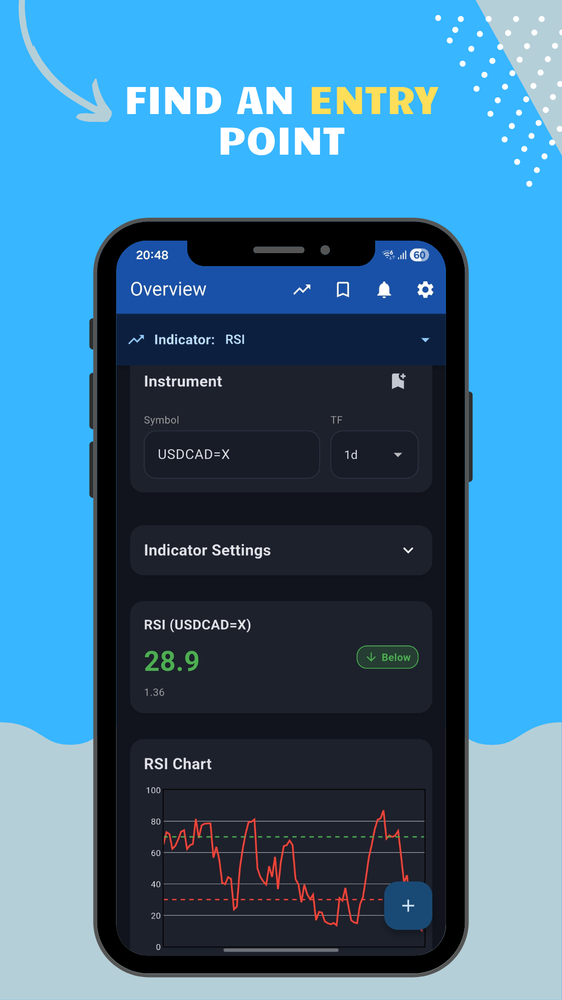
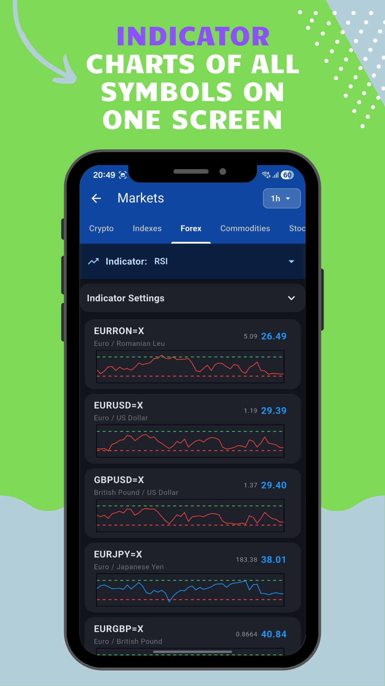
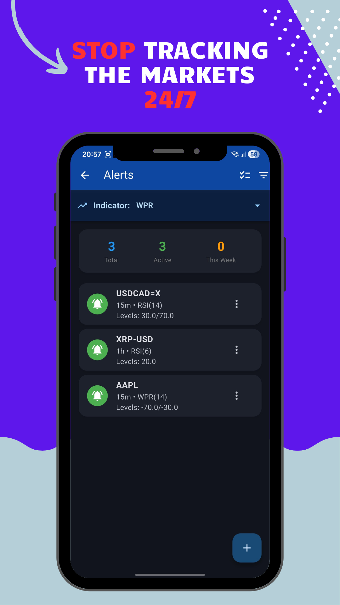
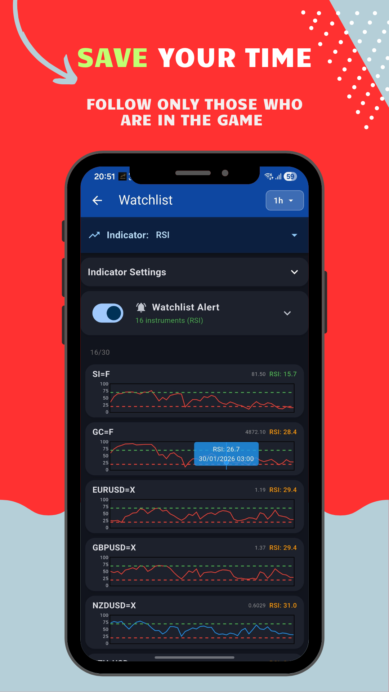
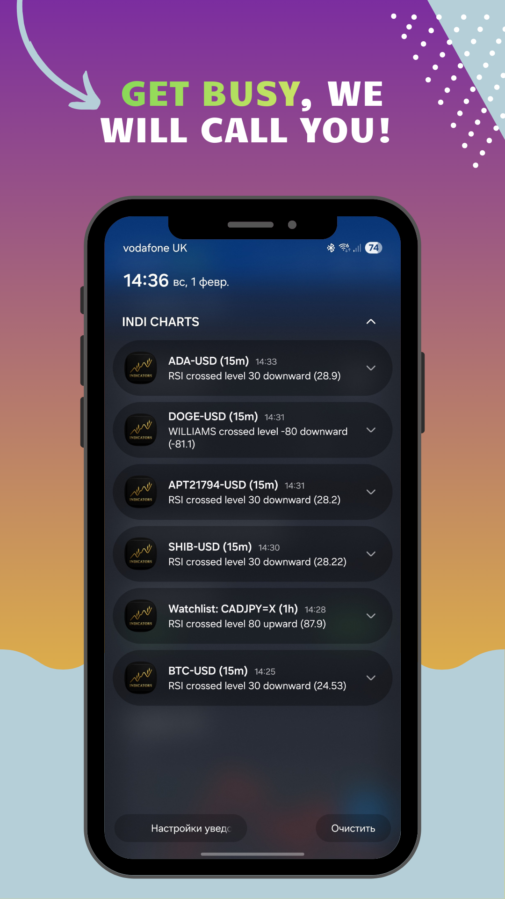
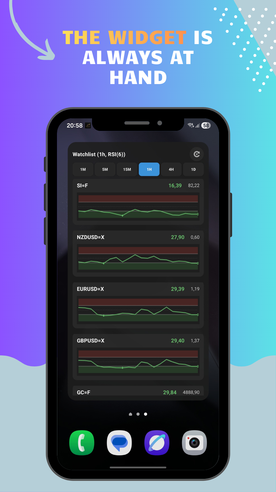

# INDI CHARTS - Technical Indicators App

[](https://flutter.dev)
[](https://dart.dev)
[](LICENSE)

A professional cross-platform mobile application for technical indicator analysis, alerts, and widgets. Monitor RSI, Stochastic, and Williams %R indicators for stocks, cryptocurrencies, forex, and commodities with real-time notifications and home screen widgets.

## 📸 Screenshots

<div align="center">
  
  
  
  
  
  
</div>

## 📱 Features

### Core Capabilities
- **Multiple Technical Indicators**: RSI, Stochastic Oscillator (%K and %D), Williams %R
- **Real-time Alerts**: Push notifications when indicators cross predefined levels
- **Home Screen Widgets**: iOS WidgetKit and Android AppWidget with live indicator charts
- **Multi-Market Support**: Stocks, cryptocurrencies, forex, commodities, and indexes
- **Multiple Timeframes**: 1m, 5m, 15m, 1h, 4h, 1d
- **Watchlist**: Track multiple instruments simultaneously
- **Markets Browser**: Browse popular instruments by category

### Advanced Features
- **Cross-Device Sync**: Firebase authentication and cloud synchronization
- **Smart Price Formatting**: Automatic precision based on price magnitude
- **Localization**: Full support for English, Russian, and Ukrainian
- **Dark/Light Themes**: Material Design 3 with customizable appearance
- **Offline Support**: Local caching with Isar database
- **Background Processing**: Automatic indicator checks and notifications

### Alert System
- **Level Crossing Alerts**: Notify when indicator crosses specific levels
- **Zone Entry/Exit**: Alerts for entering or exiting indicator zones
- **Cooldown Period**: Prevent notification spam with configurable cooldown
- **Repeatable Alerts**: Option to receive multiple triggers
- **Sound & Vibration**: Customizable notification preferences
- **Candle Close Mode**: Trigger only on candle close (reduces noise)

## 🏗️ Architecture

### Client Application (Flutter)
- **Framework**: Flutter 3.5+ with Dart 3.5+
- **UI**: Material Design 3 with custom themes
- **Charts**: fl_chart for interactive indicator visualization
- **Database**: Isar 3.1.0+ for local data persistence
- **State Management**: Custom AppState with InheritedWidget
- **Dependency Injection**: GetIt for service management

### Backend Services (Cloudflare Workers)
- **Runtime**: Cloudflare Workers with TypeScript
- **Database**: D1 (SQLite) for alert and device storage
- **Cron Jobs**: Automated indicator checks every minute
- **Push Notifications**: Firebase Cloud Messaging integration
- **Data Sources**: Yahoo Finance API (free tier)

### Widgets
- **iOS**: WidgetKit with SwiftUI
- **Android**: AppWidget with RemoteViews and custom layouts

## 📖 Usage

### Creating an Alert

1. Open the app and navigate to the main screen
2. Select an instrument (e.g., AAPL, BTC-USD, EURUSD=X)
3. Choose a timeframe (1m, 5m, 15m, 1h, 4h, 1d)
4. Select an indicator (RSI, Stochastic, or Williams %R)
5. Configure indicator period and alert levels
6. Set alert type (Level Cross, Enter Zone, or Exit Zone)
7. Configure cooldown and notification preferences
8. Save the alert

### Adding a Widget

**iOS:**
1. Long press on the home screen
2. Tap the "+" button
3. Search for "INDI CHARTS"
4. Select widget size and add to home screen

**Android:**
1. Long press on the home screen
2. Tap "Widgets"
3. Find "INDI CHARTS" widget
4. Select size and position

### Managing Watchlist

1. Navigate to Watchlist screen
2. Add instruments from the main screen or markets browser
3. Configure mass alerts for all watchlist items
4. View indicator values and charts for all instruments

## 📁 Project Structure

```
lib/
├── main.dart                    # Application entry point
├── models.dart                  # Data models (Isar schemas)
├── models/
│   └── indicator_type.dart      # Indicator type definitions
├── services/                    # Business logic services
│   ├── rsi_service.dart         # RSI calculations
│   ├── stochastic_service.dart  # Stochastic calculations
│   ├── williams_service.dart    # Williams %R calculations
│   ├── indicator_service.dart   # Universal indicator service
│   ├── yahoo_proto.dart         # Yahoo Finance API client
│   ├── firebase_service.dart    # Firebase integration
│   ├── notification_service.dart # Local notifications
│   ├── auth_service.dart        # Authentication
│   ├── user_service.dart        # User management
│   └── ...
├── screens/                     # UI screens
│   ├── home_screen.dart         # Main indicator screen
│   ├── alerts_screen.dart       # Alert management
│   ├── watchlist_screen.dart    # Watchlist management
│   ├── markets_screen.dart      # Markets browser
│   ├── create_alert_screen.dart # Alert creation/editing
│   └── settings_screen.dart     # App settings
├── widgets/                     # Reusable widgets
│   ├── rsi_chart.dart          # Indicator chart widget
│   ├── indicator_chart.dart     # Universal chart widget
│   └── ...
├── utils/                       # Utilities
│   ├── price_formatter.dart    # Smart price formatting
│   ├── context_extensions.dart # BuildContext extensions
│   └── ...
└── localization/
    └── app_localizations.dart   # Localization strings

workers/
├── src/
│   ├── index.ts                # Workers entry point
│   ├── rsi-engine.ts          # Indicator calculation engine
│   ├── fcm-service.ts          # Firebase Cloud Messaging
│   ├── yahoo-service.ts       # Yahoo Finance integration
│   └── ...
├── schema.sql                  # D1 database schema
└── wrangler.toml              # Workers configuration

android/
├── app/
│   ├── src/main/
│   │   ├── AndroidManifest.xml
│   │   ├── kotlin/com/indicharts/app/
│   │   │   ├── MainActivity.kt
│   │   │   ├── RSIWidgetProvider.kt
│   │   │   └── RSIWidgetService.kt
│   │   └── res/
│   │       └── xml/widget_info.xml
│   └── build.gradle
└── ...

ios/
├── Runner/
│   ├── AppDelegate.swift
│   └── Info.plist
└── RSIWidget/
    └── RSIWidget.swift
```

## 🌐 Localization

The app supports three languages:
- **English** (en)
- **Russian** (ru)
- **Ukrainian** (uk)

All user-facing strings, notifications, and alerts are fully localized. To add a new language, update `lib/localization/app_localizations.dart`.

## 🔐 Permissions

### Android
- `INTERNET` - Required for fetching market data
- `POST_NOTIFICATIONS` - Requested only when creating alerts (doesn't block UI on startup)

### iOS
- Notification permissions - Requested when creating alerts

## 📊 Supported Indicators

### RSI (Relative Strength Index)
- Default period: 14
- Default levels: 30, 70
- Range: 0-100

### Stochastic Oscillator
- %K period: 14 (default)
- %D period: 3 (default)
- Range: 0-100

### Williams %R
- Default period: 14
- Default levels: -80, -20
- Range: -100 to 0

## 🔌 API Endpoints

### Cloudflare Workers API

- `GET /yf/candles?symbol={symbol}&tf={timeframe}&limit={limit}` - Get candle data
- `GET /yf/quote?symbol={symbol}` - Get current price
- `GET /yf/info?symbol={symbol}` - Get symbol information
- `POST /device/register` - Register device for push notifications
- `GET /alerts/:userId` - Get user alerts
- `POST /alerts/create` - Create alert
- `POST /alerts/check` - Check alert triggers (cron job)

## 🛠️ Technologies

### Frontend
- **Flutter** - Cross-platform framework
- **Isar** - Local NoSQL database
- **fl_chart** - Chart visualization
- **Firebase** - Authentication and push notifications
- **Material Design 3** - UI components

### Backend
- **Cloudflare Workers** - Serverless runtime
- **D1 Database** - SQLite in the cloud
- **Firebase Cloud Messaging** - Push notifications
- **Yahoo Finance API** - Market data source

## 📧 Support

- **Email**: vovan4ikukraine@gmail.com

## 📄 License

This project is licensed under the **GNU Affero General Public License v3.0 (AGPL-3.0)**.

### Why AGPL-3.0?

This license ensures that:
- Any modifications or forks must remain open source
- If someone deploys a modified backend, they must share the source code
- Commercial entities cannot use this code without proper licensing

For commercial licensing inquiries, please contact the project maintainers.

## 🙏 Acknowledgments

- Yahoo Finance for providing free market data
- Flutter team for the excellent framework
- Cloudflare for Workers platform
- Firebase for authentication and messaging services

---

**Made with ❤️ for traders and investors**
